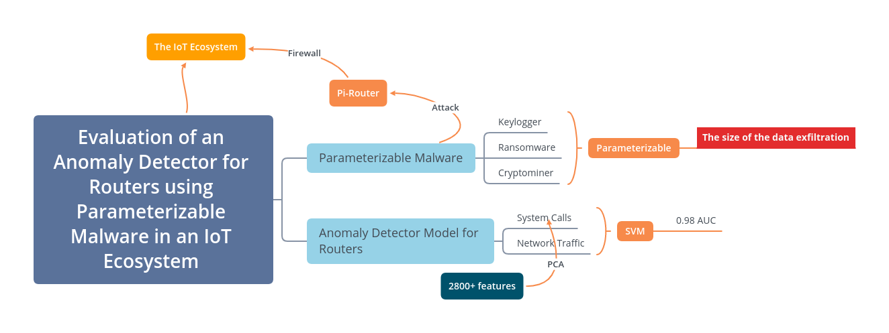
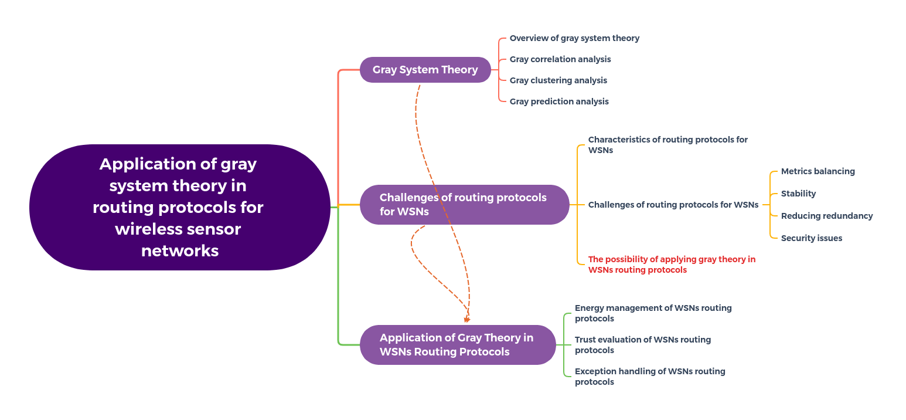

### Evaluation of an Anomaly Detector for Routers using Parameterizable Malware in an IoT Ecosystem – UbiSec_2021_paper_38

​	这篇论文主要做了两个工作，一是实现了一个可参数化的恶意软件，可调参数包括但不限于数据的渗出大小，通过攻击路由器来达到窃取物联网生态系统数据的目的；二是实现了一个基于SVM的恶意软件检测器，通过系统调用和网络信息总共2800维特征的输入，使用PCA降维后，达到了0.98 的AUC，同时可以检测出可变参数的恶意软件。可参数化的恶意软件和异常检测器的共同设计对设计一个强大的检测器是非常有效的，可以检测到难以捉摸，不显眼的恶意软件。但是论文对于选择PCA降维和SVM用作分类模型的依据只是笼统的提到，没有实验对比数据，信服力低，而且在最后的结论部分有少许的语法错误和词性使用错误。

审稿意见: 

Review‘s comments on Evaluation of an Anomaly Detector for Routers using Parameterizable Malware in an IoT Ecosystem–John Carter and Spiros Mancoridis:

​	This is a well-written paper containing interesting results which merit publication. For the benefit of the reader, however, a number of points need clarifying and certain statements require further justification. There are given below.

​	This research creates parameterizable malware on the Pi-Router in a self-build IoT Ecosystem, and the malware provides several degrees of freedom with which to create varied data and evaluate the anomaly detection model under different environmental conditions. The malware's degrees of freedom were significant in providing a way to quickly generate different data from the same malware family to test the classifier's ability to adapt to changing malware behavior. Besides, using inputs from system calls and network traffic, the paper implements an SVM classifier to detect the malware and get a mean AUC value of 0.98, which is a significant improvement. The co-design of parameterizable malware and anomaly detectors is useful to design a robust detector that can detect elusive, inconspicuous, malware.

​	This paper nicely combines the features of system calls and network traffic data to obtain excellent malware detectors.  A parameterizable malware is also implemented to detect the effectiveness of the malware detector. In addition, the icons in the paper are unambiguous, which can show the effectiveness of the model very well. Finally, the paper proposes the use of GAN for future work is also a great idea. However, the paper requires a little attention to English grammar and vocabulary patterns in the “Conclusion & Future Work”. It is noted that your manuscript needs careful editing by someone with expertise in technical English editing paying particular attention to English grammar, spelling, and sentence structure so that the goals and results of the study are clear to the reader.Besides, when using PCA to downscale 2800 features, it is necessary to explain the final result.  In addition, one can add the experimental rationale for using PCA dimensionality reduction to confirm the effectiveness and efficiency of PCA, and likewise cite the effectiveness of other classifiers in detecting malware, such as XGboost, while giving reasons for choosing the SVM model.

​	The final recommendation for this paper is to accept.

### Application of gray system theory in routing protocols for wireless sensor networks – UbiSec_2021_paper_31

​	文介绍了灰色系统理论和WSNs路由协议的相关概念，分析了当前WSNs路由协议的特点和面临的挑战，灰色系统理论在WSNs中应用的可能性，最后分析并总结了现有的算法，以促进灰度系统理论在WSN中的应用。这篇文章偏于综述方向，介绍了灰色系统理论和其在WSNs中应用的可能性、方法和结论，总结了前面很多论文的方法，最后使用多张图表来证实灰色系统理论应用的有效性。因为该篇论文专业性比较重，且是综述类文章，阅读较困难，我并不能很好的理解论文中的一些概念，但是作者的提纲列的非常详细和明确，论文整体的思路是很通畅的，所以我并不能提出一些建议和想法。

审稿意见: 

Review‘s comments on Application of gray system theory in routing protocols for wireless sensor networks–Xin Lv and Feng Xu:

​	This is a carefully done study and the findings are of considerable interest. A few minor revisions are list below.

​	This research introduces the concepts related to gray system theory, analyzes the characteristics of wireless sensor network routing protocols and challenges they face, studies the possibility of applying gray correlation analysis, gray prediction analysis and gray clustering analysis to wireless sensor network routing protocols, and finally analyzes and summarizes the existing algorithms for the application of gray system theory in  wireless sensor network routing protocol.	

​	This paper provides a good summary of the possibilities of applying gray system theory to routing protocols for wireless sensor networks, along with a detailed list of existing application papers and methods. At the same time, the paper shows vividly by citing a large amount of literature and in tabular form that gray system theory is an effective and feasible approach to the challenges now faced by routing protocols for wireless sensor networks. In addition, the overall format of the paper conforms to the specification. 

​	The final recommendation for this paper is to accept.	
